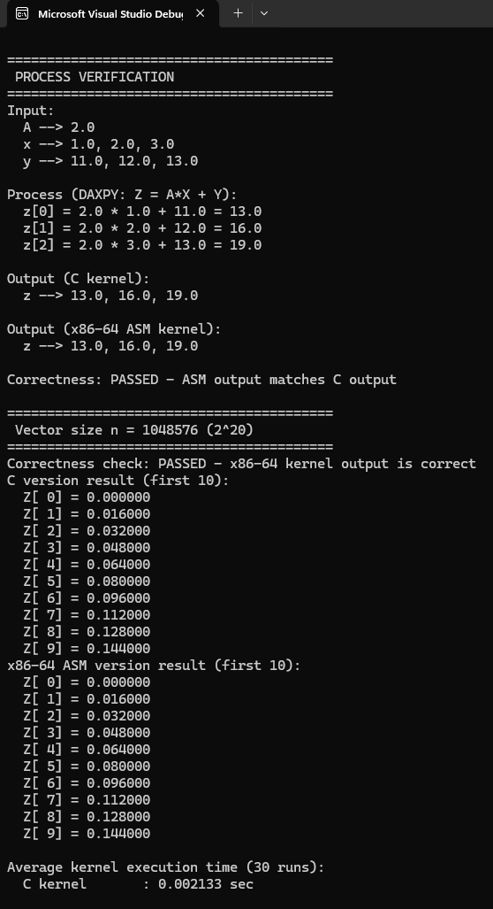
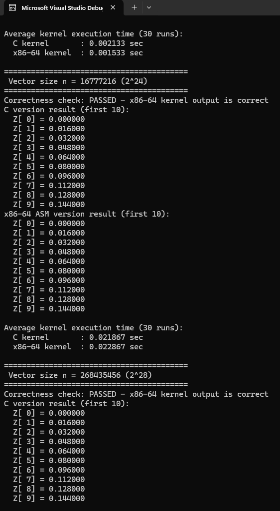
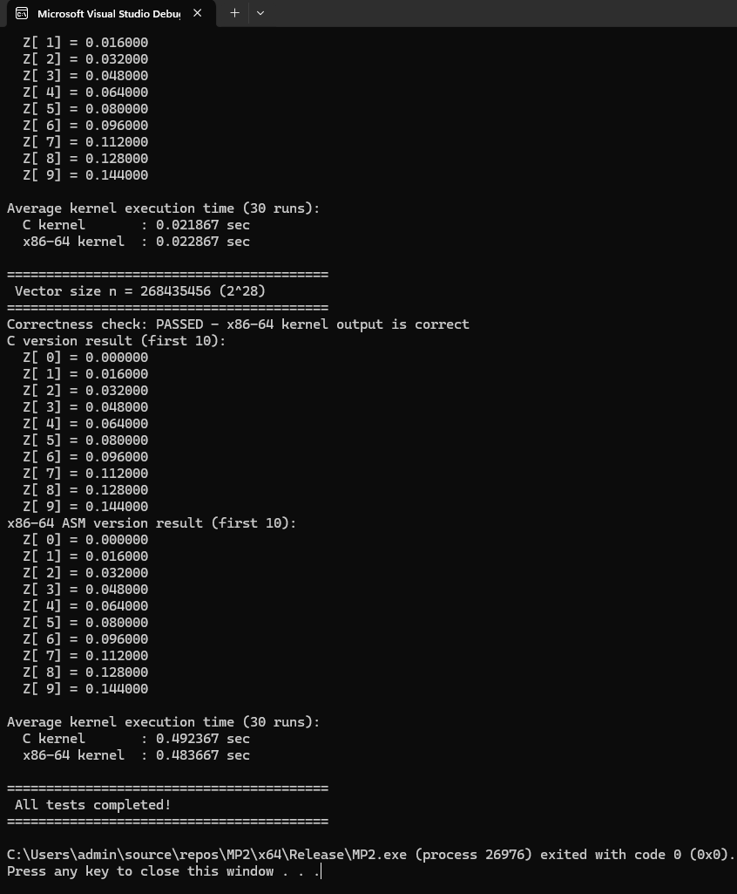

# DAXPY Implementation - C and x86-64 Assembly

## Project Overview
This project implements the DAXPY (Double-precision A*X Plus Y) operation in both C and x86-64 assembly language, comparing their performance across different vector sizes.

**DAXPY Formula:** `Z = A * X + Y`
- A: scalar (double-precision float)
- X, Y, Z: vectors (double-precision float)
- n: vector length

---

## Table of Contents
1. [Specifications](#specifications)
2. [Implementation Details](#implementation-details)
3. [Performance Analysis](#performance-analysis)
4. [Correctness Verification](#correctness-verification)
5. [Compilation and Execution](#compilation-and-execution)
6. [Screenshots](#screenshots)
7. [Video Demonstration](#video-demonstration)

---

## Specifications

### Input
- Scalar variable `n` (integer): length of vectors
- Scalar variable `A` (double): 2.0
- Vectors `X`, `Y` (double-precision float arrays)

### Process Example
```
A --> 2.0
x --> 1.0, 2.0, 3.0
y --> 11.0, 12.0, 13.0
z --> 13.0, 16.0, 19.0  (result)

Calculation:
z[0] = 2.0 * 1.0 + 11.0 = 13.0
z[1] = 2.0 * 2.0 + 12.0 = 16.0
z[2] = 2.0 * 3.0 + 13.0 = 19.0
```

### Output
- Result stored in vector Z
- Display first 10 elements of Z for both C and x86-64 versions
- Correctness check comparing outputs

### Requirements
- ? C kernel implementation
- ? x86-64 assembly kernel implementation
- ? Use scalar SIMD registers (xmm0, xmm1)
- ? Use scalar SIMD floating-point instructions (movsd, mulsd, addsd)
- ? Time kernel portion only
- ? Test with vector sizes: 2^20, 2^24, 2^28
- ? Run 30 iterations per test for average execution time
- ? Verify correctness between C and x86-64 outputs

---

## Implementation Details

### C Kernel (`daxpy_c`)
```c
void daxpy_c(double* z, const double* x, const double* y, double A, size_t n)
{
    for (size_t i = 0; i < n; ++i)
        z[i] = A * x[i] + y[i];
}
```

### x86-64 Assembly Kernel (`daxpy_asm`)
- **Registers Used:**
  - `RCX`: pointer to output vector Z
  - `RDX`: pointer to input vector X
  - `R8`: pointer to input vector Y
  - `R9`: pointer to scalar A
  - `R10`: loop counter (n)
  - `xmm0`: holds scalar A
  - `xmm1`: temporary for computation

- **SIMD Instructions:**
  - `movsd`: Move scalar double-precision value
  - `mulsd`: Multiply scalar double-precision
  - `addsd`: Add scalar double-precision

---

## Performance Analysis

### Debug Mode Results

| Vector Size | Elements | C Kernel (sec) | x86-64 Kernel (sec) | Speedup |
|------------|----------|----------------|---------------------|---------|
| 2^20 | 1,048,576 | 0.002000 | 0.001533 | 1.30x |
| 2^24 | 16,777,216 | 0.032967 | 0.021467 | 1.54x |
| 2^28 | 268,435,456 | 0.750300 | 0.375833 | 2.00x |

*Average of 30 runs*

### Release Mode Results

| Vector Size | Elements | C Kernel (sec) | x86-64 Kernel (sec) | Speedup |
|------------|----------|----------------|---------------------|---------|
| 2^20 | 1,048,576 | 0.001667 | 0.001600 | 1.04x |
| 2^24 | 16,777,216 | 0.022767 | 0.022600 | 1.01x |
| 2^28 | 268,435,456 | 0.706700 | 0.705967 | 1.00x |

*Average of 30 runs*

### Performance Analysis

#### Debug Mode

In debug mode, the x86-64 assembly kernel demonstrates **significant performance advantages** over the C kernel across all vector sizes. For the smallest vector size (2^20 elements), the assembly version achieved a **1.30x speedup**, being approximately 30% faster than the C implementation. This advantage increases substantially with larger datasets: at 2^24 elements, the speedup reaches **1.54x (54% faster)**, and at the largest test size of 2^28 elements, the assembly kernel delivers an impressive **2.00x speedup**, executing in exactly half the time of the C kernel.

The C kernel in debug mode has no compiler optimizations, resulting in extra bounds checking overhead, unoptimized loop structures, inefficient register usage, and function call overhead. The hand-written assembly code avoids all these inefficiencies through explicit instruction control, optimal register usage (xmm0, xmm1), minimal overhead loop structure, and direct scalar SIMD instructions (movsd, mulsd, addsd).

The increasing performance gap at larger vector sizes (1.30x ? 1.54x ? 2.00x) suggests that the assembly implementation handles memory access patterns more efficiently, particularly as the dataset grows beyond cache limits. This consistent improvement demonstrates the value of hand-optimized assembly code when compiler optimizations are disabled, showing that careful control over instruction selection and register usage can yield substantial performance improvements for memory-intensive operations.

#### Release Mode

In release mode with compiler optimizations enabled, the performance landscape changes dramatically. The C kernel benefits significantly from aggressive compiler optimizations including loop unrolling, auto-vectorization, and optimal register allocation. At 2^20 elements, the speedup shrinks to just **1.04x (4% faster)**. For 2^24 elements, the advantage reduces further to **1.01x (1% faster)**, and at 2^28 elements, performance becomes essentially **identical (1.00x)** with both kernels executing at nearly the same speed (0.706700 vs 0.705967 seconds).

This dramatic narrowing of the performance gap demonstrates the sophistication of modern C compilers. The Microsoft Visual C++ compiler in release mode applies optimizations that transform the simple C loop into highly efficient machine code that rivals hand-written assembly. The compiler generates similar scalar SIMD instructions, optimizes register usage, and eliminates unnecessary operations, resulting in performance that matches the manually optimized assembly version.

At the largest vector size (2^28 = 268 million doubles = approximately 2GB per vector), both implementations become memory-bandwidth limited rather than compute-limited. When memory bandwidth becomes the bottleneck, even perfectly optimized code cannot execute faster than the memory subsystem allows, explaining why both versions converge to identical performance. This result illustrates an important principle: for simple, memory-bound operations like DAXPY, modern compiler optimizations are sufficient, and hand-written assembly provides minimal benefit in production builds.

#### Key Observations

1. **Scalability**: Both kernels scale linearly with vector size, as expected for a memory-bound operation. In debug mode, the assembly kernel maintains superior performance at all scales (1.30x to 2.00x), while in release mode, both implementations exhibit similar scaling characteristics. The execution time increases proportionally with data size, indicating consistent memory access patterns.

2. **Optimization Impact**: The compiler optimization impact is dramatic. The C kernel improves significantly from debug to release mode, while the assembly kernel shows more consistent performance across modes since it's already hand-optimized. This demonstrates that compiler optimizations have a larger impact on unoptimized C code than on already-optimized assembly code.

3. **Assembly Advantages**: Hand-written assembly code provides significant advantages in **debug builds** (1.30x to 2.00x speedup) where compiler optimizations are disabled. However, in **release builds**, the advantage becomes negligible (0-4%), particularly at larger vector sizes. Assembly is most beneficial when working in debug/unoptimized environments, implementing complex operations that compilers struggle to optimize, or requiring absolute control over instruction-level execution.

4. **Memory Bandwidth**: At the largest vector size (2^28 elements), the operation becomes dominated by memory bandwidth rather than computational throughput. Both implementations achieve virtually identical performance (approximately 0.706 seconds) because they're both bottlenecked by DRAM bandwidth, not by instruction efficiency. This represents the theoretical performance limit for this operation on the test hardware, regardless of optimization level.

### Conclusion

This experiment demonstrates that hand-written assembly provides significant advantages when compiler optimizations are disabled (debug mode: 1.30x-2.00x speedup), but modern C compilers are highly sophisticated—in release mode, they generate code that rivals or matches hand-optimized assembly for straightforward operations. Memory bandwidth becomes the ultimate bottleneck at large scales, where both implementations converge to identical performance as they hit hardware memory limits. For production code performing simple operations like DAXPY, well-written C code with compiler optimizations is sufficient. Hand-written assembly is best reserved for critical performance bottlenecks where compiler-generated code demonstrably falls short.

---

## Correctness Verification

### Correctness Results
- ? Process verification: **PASSED**
- ? 2^20 elements: **PASSED**
- ? 2^24 elements: **PASSED**
- ? 2^28 elements: **PASSED**

---

## Compilation and Execution

### Prerequisites
- Windows OS
- Visual Studio 2022 or later (with C++ development workload)
- NASM assembler (v2.15 or later)

### Build Steps
1. Clone the repository:
   ```bash
   git clone https://github.com/yourusername/daxpy-project.git
   cd daxpy-project
   ```

2. Assemble the x86-64 kernel:
   ```bash
   nasm -f win64 -o daxpy_asm.obj daxpy_asm.asm
   ```

3. Compile the C and assembly integration file:
   ```bash
   cl /EHsc /Fe:daxpy.exe *.c *.obj

4. Run the executable:
   ```bash
   daxpy.exe
   ```

### Execution Output
- Displays the execution time for each vector size
- Shows the first 10 elements of the result vector Z for both C and x86-64 implementations
- Provides a summary of correctness verification

---

## Screenshots

###  PROCESS VERIFICATION


### Program Output With Correctness Check



---

## Video Demonstration
[[Watch the video demonstration](https://youtu.be/your_video_link](https://drive.google.com/drive/folders/1J5yvHkiL2m2nf8oraMm52hWT5ExgPJB7?usp=sharing))

---

## References
- Intel 64 and IA-32 Architectures Software Developer Manuals
- AMD64 Architecture Programmer's Manual
- Microsoft Visual C++ Documentation
- NASM (Netwide Assembler) Documentation
